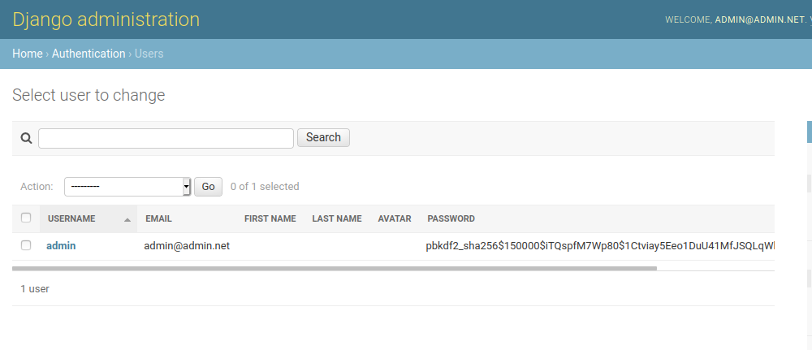
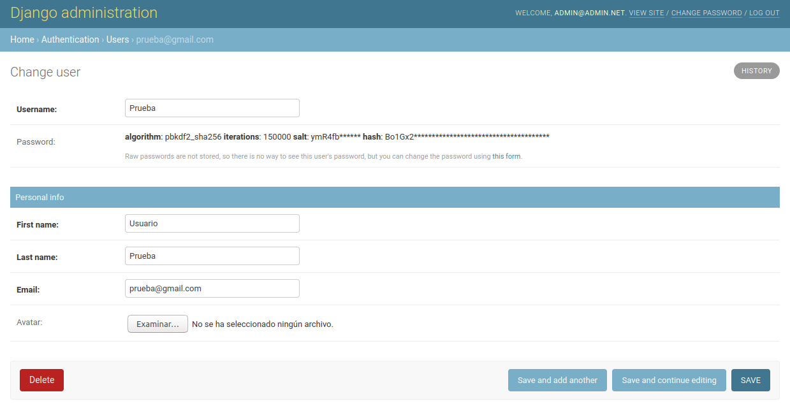
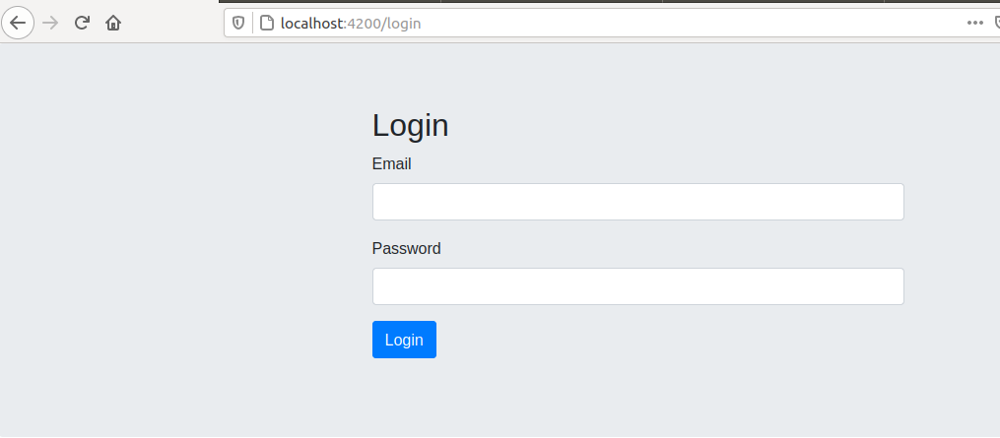
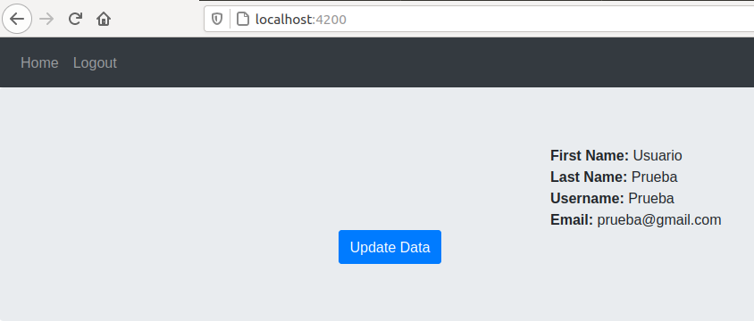
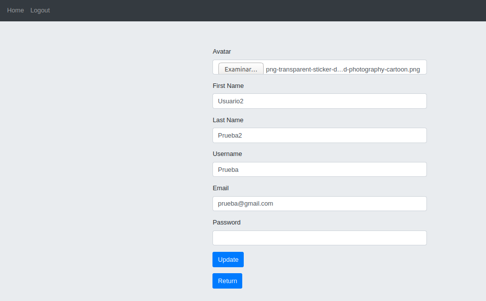
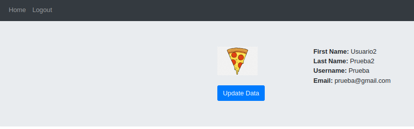

# Basic Login Django Angular
This is a basic login web developed with django and angular for a technical test

### Prerequisites
- Docker
- Docker-compose
- Npm
- Node

### Installing

#### Frontend

Go to the frontend and install de dependencies.

```
~/frontend$ npm install
```
#### Backend

Go to the backend and build the containers

```
~/backend$ sudo docker-compose up --build
```

## Running

### Frontend

Start the application on port 4200

```
~/frontend$ npm start
```

### Backend
Start the backend on port 8000

```
~/backend$ sudo docker-compose up
```

## Deployment

## Built With

* [Angular](https://angular.io/) - The web framework used
* [Django](https://www.djangoproject.com/) - Backend
* [Django Rest Framework](https://www.django-rest-framework.org/) - API Rest
* [Docker](https://www.docker.com/) - Containerized
* [Posgresql](https://www.postgresql.org/) - Database

## Usage

Access to django administration with this credentials:

email: admin@admin.net

password: admin

url: http://localhost:8000/admin



Create a user from the administration panel



Go to frontend and try to log with the created credentials





Once logged in, edit the user data





## Authors

* **Iván Pérez Fita** - [Zar21](https://github.com/Zar21)
